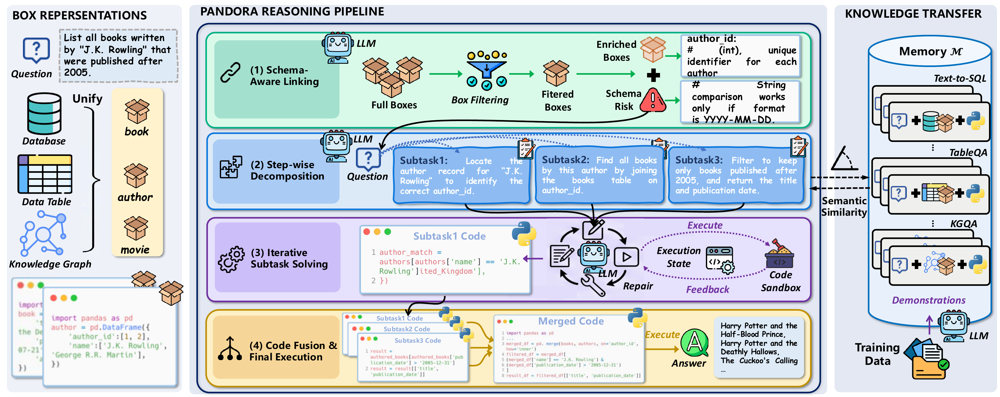
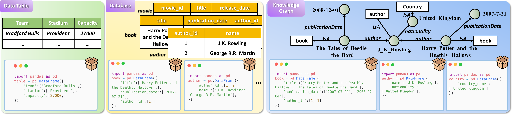

# PANDORA

<p align="center">
  <strong>Leveraging Code-driven Knowledge Transfer for Unified Structured Knowledge Reasoning</strong>
</p>

<p align="center">
  <a href="https://github.com/Bahuia/pandora/actions/workflows/ci.yml"></a>
  <a href="https://www.python.org/"></a>
  <a href="LICENSE"></a>
  <a href="https://doi.org/10.1109/TKDE.2026.3718049"></a>
  <a href="https://huggingface.co/datasets/bahuia/pandora-data"></a>
</p>

This repository is the official implementation of
**[PANDORA: Leveraging Code-driven Knowledge Transfer for Unified Structured
Knowledge Reasoning](https://ieeexplore.ieee.org/document/11627196)**, published
in *IEEE Transactions on Knowledge and Data Engineering* (TKDE), Early Access,
2026. [Paper](https://ieeexplore.ieee.org/document/11627196) |
[DOI](https://doi.org/10.1109/TKDE.2026.3718049) |
[Data](https://huggingface.co/datasets/bahuia/pandora-data)

**Yongrui Chen, Junhao He, Linbo Fu, Shenyu Zhang, Rihui Jin, Xinbang Dai,
Jiaqi Li, Dehai Min, Nan Hu, Yuxin Zhang, Guilin Qi, Yi Huang, and Tongtong Wu**

PANDORA represents tables, relational databases, and knowledge-graph subgraphs
through a shared Pandas DataFrame interface called **BOX**. An LLM then performs
schema-aware linking, step-wise decomposition, iterative executable-code
reasoning, execution-guided repair, and final code fusion over this unified
representation.

## Overview



The core workflow has four stages:

1. **Schema-aware linking** filters the full BOX collection and enriches the
   relevant schemas for the question.
2. **Step-wise decomposition** converts the question into an ordered sequence
   of executable subtasks.
3. **Iterative subtask solving** generates Pandas code, executes it in a
   sandbox, and repairs failures using execution feedback.
4. **Code fusion and final execution** merges validated subtask programs and
   executes the complete solution to obtain the answer.

Tables, databases, and knowledge graphs share the same BOX programming
interface:



## Benchmark Coverage

The paper evaluates PANDORA on seven benchmarks spanning Text-to-SQL, TableQA,
and KGQA. The current public data-preparation and execution workflow covers the
following five benchmarks end to end:

| Task | Benchmark | Split | Public preparation | Run script |
|---|---|---:|---|---|
| Text-to-SQL | Spider | dev | Import official Spider package | `examples/run_spider.sh` |
| Text-to-SQL | Spider-Syn | test | Pandora annotation + Spider databases | `examples/run_spider_syn.sh` |
| Text-to-SQL | BIRD | dev | Pandora annotation + official BIRD databases | `examples/run_bird.sh` |
| TableQA | WikiTableQuestions | test | `pandora-data` download | `examples/run_wikitq.sh` |
| TableQA | WikiSQL | test | `pandora-data` download | `examples/run_wikisql.sh` |

The paper additionally reports KGQA experiments on GrailQA and WebQSP. See the
[paper](https://ieeexplore.ieee.org/document/11627196) for the complete
experimental setting.

## Installation

Python 3.9, 3.10, and 3.11 are tested in CI.

```bash
git clone https://github.com/Bahuia/pandora.git
cd pandora

python -m venv .venv
source .venv/bin/activate
python -m pip install --upgrade pip
python -m pip install -e .

pandora --help
pandora-data --help
```

For development and repository verification, install the additional tools:

```bash
python -m pip install -r requirements-dev.txt
```

## Data Preparation

Benchmark data is stored outside Git history. Select one reusable data root:

```bash
export PANDORA_DATA_ROOT="${PWD}/data"
pandora-data list
```

### WikiTableQuestions and WikiSQL

These processed test splits are downloaded from the versioned
[`bahuia/pandora-data`](https://huggingface.co/datasets/bahuia/pandora-data)
repository and materialized automatically:

```bash
pandora-data prepare --dataset wikitq
pandora-data prepare --dataset wikisql
```

### Spider and Spider-Syn

Download Spider from the
[official Spider project](https://github.com/taoyds/spider). Pass either the
extracted directory or the downloaded archive to PANDORA:

```bash
pandora-data prepare --dataset spider --source /path/to/official-spider
pandora-data prepare --dataset spider-syn
```

Spider-Syn uses the official Spider schemas and SQLite databases. Prepare
Spider before Spider-Syn.

### BIRD

Download the development database package from the
[official BIRD project](https://bird-bench.github.io/), then import it:

```bash
pandora-data prepare --dataset bird --source /path/to/official-bird-dev
```

### Verify all benchmarks

```bash
pandora-data status --root "$PANDORA_DATA_ROOT"
pandora-data verify --dataset all --root "$PANDORA_DATA_ROOT"
```

A successful installation reports all five datasets as `ready`. Downloads
support standard `HTTP_PROXY`, `HTTPS_PROXY`, and `NO_PROXY` variables, resume
when the server supports byte ranges, and reuse the local cache. Exact source
links, expected layouts, checksums, and licensing notes are documented in
[DATASETS.md](DATASETS.md).

## Model Configuration

PANDORA supports the official OpenAI, DeepSeek, and Qwen APIs, plus explicit
OpenAI-compatible endpoints. Keep all credentials in environment variables.

### OpenAI

```bash
export OPENAI_API_KEY="your-api-key"
export PANDORA_PROVIDER="openai"
export PANDORA_MODEL="gpt-4o-mini"
```

### DeepSeek

```bash
export DEEPSEEK_API_KEY="your-api-key"
export PANDORA_PROVIDER="deepseek"
export PANDORA_MODEL="deepseek-chat"
```

### Qwen / DashScope

```bash
export DASHSCOPE_API_KEY="your-api-key"
export PANDORA_PROVIDER="qwen"
export PANDORA_MODEL="qwen-plus"
```

### OpenAI-compatible endpoint

```bash
export PANDORA_API_KEY="your-api-key"
export PANDORA_BASE_URL="https://your-endpoint.example/v1"
export PANDORA_PROVIDER="openai-compatible"
export PANDORA_MODEL="your-model-name"
```

No proxy or compatible endpoint is configured by default.

## Run PANDORA

Start with one example from each benchmark to validate data loading, prompt
construction, model access, code execution, answer serialization, and
evaluation:

```bash
./examples/run_spider.sh --num-samples 1
./examples/run_spider_syn.sh --num-samples 1
./examples/run_bird.sh --num-samples 1
./examples/run_wikitq.sh --num-samples 1
./examples/run_wikisql.sh --num-samples 1
```

The scripts read `PANDORA_DATA_ROOT`, `PANDORA_MODEL`, `PANDORA_PROVIDER`,
`PANDORA_BASE_URL`, and `PANDORA_OUTPUT_DIR`. Extra arguments are forwarded to
the `pandora` CLI.

To run a complete benchmark split, omit `--num-samples`:

```bash
./examples/run_spider.sh
./examples/run_spider_syn.sh
./examples/run_bird.sh
./examples/run_wikitq.sh
./examples/run_wikisql.sh
```

For example, a direct Spider command equivalent to the public script is:

```bash
pandora \
  --task nl2sql \
  --dataset spider \
  --stage dev \
  --model "$PANDORA_MODEL" \
  --provider "$PANDORA_PROVIDER" \
  --data-root "$PANDORA_DATA_ROOT" \
  --output-dir "${PANDORA_OUTPUT_DIR:-./results}" \
  --shot-k 0 \
  --retrieval-mode disabled \
  --num-samples 1
```

Useful controls include:

| Option | Purpose |
|---|---|
| `--num-samples N` | Run the first `N` selected examples |
| `--start-idx N` | Start from dataset index `N` |
| `--qids ID ...` | Run specific question identifiers |
| `--num-workers N` | Process `N` samples concurrently |
| `--n-votes N` | Generate and vote over `N` candidates per sample |
| `--shot-k K` | Select the number of retrieved demonstrations |
| `--retrieval-mode MODE` | Choose `cross_task`, `same_dataset`, or `disabled` retrieval |
| `--temperature T` | Set model sampling temperature |
| `--output-dir PATH` | Choose the result directory |

Run `pandora --help` for the complete interface.

## Outputs and Metrics

Each run writes a timestamped JSON result and log file to `results/` by default,
or to `PANDORA_OUTPUT_DIR` when that variable is set:

```text
results/
|-- spider_dev_YYYYMMDD_HHMMSS.json
`-- spider_dev_YYYYMMDD_HHMMSS.log
```

The JSON file is updated incrementally and contains:

| Field | Description |
|---|---|
| `test_config` | Task, dataset, model, mode, retrieval, concurrency, and timestamp |
| `accuracy_metrics` | Sample count, execution success, EM, average F1, Hit@1, and timing |
| `total_time_sec` | Sum of per-sample execution times |
| `wall_clock_time_sec` | End-to-end elapsed time |
| `detailed_results` | Per-example question, prediction, execution state, metrics, and errors |

## Paper Ablations

The main CLI exposes the method ablations used by the paper:

```bash
pandora ... --ablation no_knowledge_transfer
pandora ... --ablation no_decomposition
pandora ... --ablation no_execution_feedback
pandora ... --ablation no_code_merge
```

## Testing and Repository Verification

Run the deterministic unit suite without benchmark assets or model API calls:

```bash
python -m pytest -m "not integration"
```

After preparing all five benchmarks, run the integration suite:

```bash
PANDORA_DATA_ROOT="$PANDORA_DATA_ROOT" python -m pytest -m integration
```

The integration suite validates all five dataset adapters, first-example
preprocessing, and complete CLI request/response paths through a local fake
OpenAI-compatible endpoint. It does not consume model API credits.

Additional release checks are:

```bash
python -m compileall -q core datasets models pandora_data prompts utils scripts run.py
python -m build
python scripts/audit_repository.py --mode repository --strict
PANDORA_DATA_ROOT="$PANDORA_DATA_ROOT" \
  python scripts/audit_repository.py --mode benchmark-ready --strict
```

Generated code is AST-validated and executed in an isolated subprocess with
configurable time, CPU, and memory limits. This research sandbox is not a
production security boundary.

## Reproducibility Notes

- Processed public annotations are pinned to
  `bahuia/pandora-data@v0.1.0-benchmark-preview` and verified with SHA256.
- Official Spider and BIRD database assets retain their publisher-provided
  contents and licenses.
- Model APIs may change over time. Record the model identifier, endpoint
  implementation, and run configuration stored in each result JSON.
- Runtime outputs, downloaded datasets, caches, and logs are excluded from Git.

## Citation

If you use PANDORA, please cite the TKDE paper:

```bibtex
@article{chen2026pandora,
  author  = {Yongrui Chen and Junhao He and Linbo Fu and Shenyu Zhang and
             Rihui Jin and Xinbang Dai and Jiaqi Li and Dehai Min and Nan Hu and
             Yuxin Zhang and Guilin Qi and Yi Huang and Tongtong Wu},
  title   = {{PANDORA}: Leveraging Code-driven Knowledge Transfer for Unified
             Structured Knowledge Reasoning},
  journal = {IEEE Transactions on Knowledge and Data Engineering},
  year    = {2026},
  pages   = {1--27},
  doi     = {10.1109/TKDE.2026.3718049}
}
```

Machine-readable citation metadata is available in [CITATION.cff](CITATION.cff).

## License and Acknowledgements

PANDORA source code is released under the [Apache License 2.0](LICENSE).
Benchmark data remains governed by its upstream license and attribution terms;
see [THIRD_PARTY_DATA.md](THIRD_PARTY_DATA.md) and [DATASETS.md](DATASETS.md).

We thank the creators and maintainers of Spider, Spider-Syn, BIRD,
WikiTableQuestions, WikiSQL, GrailQA, and WebQSP. Contribution guidelines are in
[CONTRIBUTING.md](CONTRIBUTING.md), and security reports are handled according
to [SECURITY.md](SECURITY.md).
